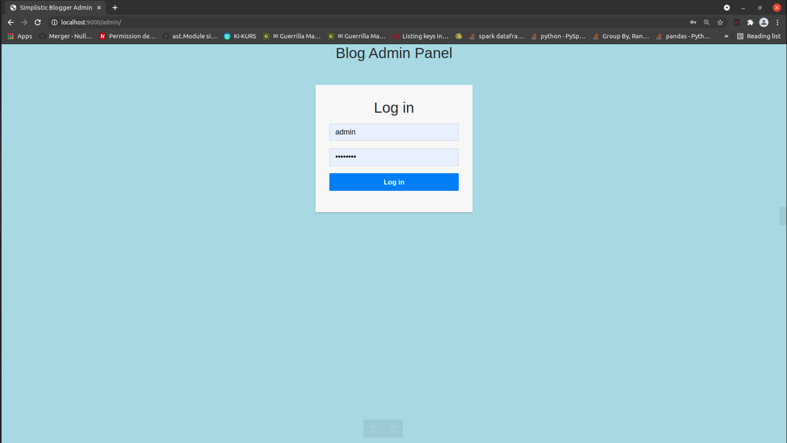
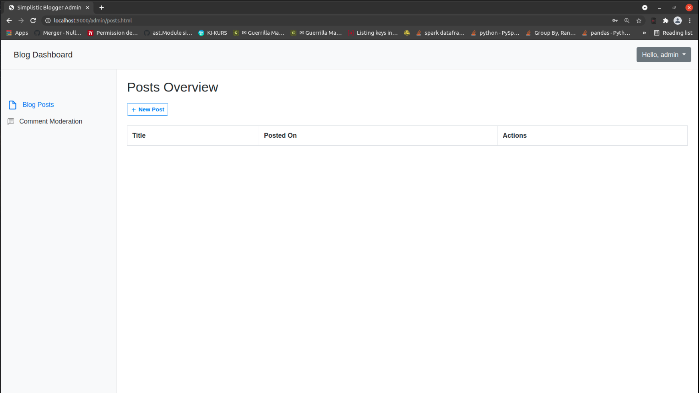
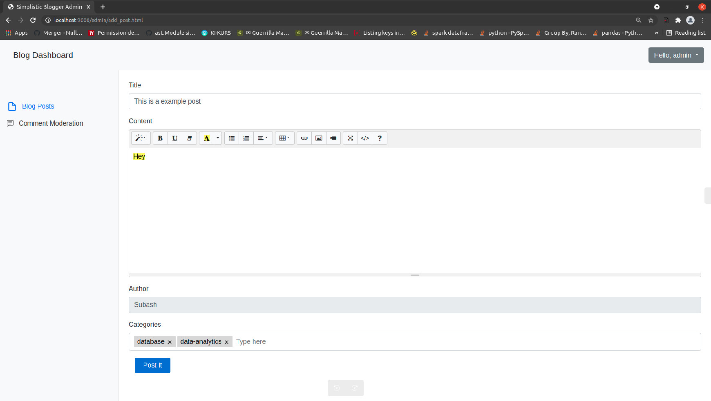
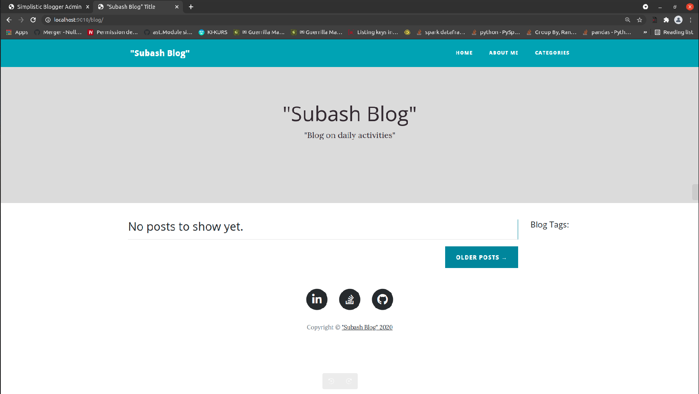

# Create your blogging website from groundup full configured :notebook:

## Motivation:  
Everybody is motivated to create a blog website to write on their activities, or share something with their friend and family. But, developing something on own is time consuming and often people resort to the blogging sites which would read your content. Keeping this in mind, this web app is created with basic functionality to bring up docker containers on a purchased VM (aws, digitalocean, heroku etc..) and quickly launch with few commands.  

## Setup:  
Important part of the setup is the centered with env_template, let us look that in details:  
| Configuration        | Description           | Values  |
| ------------- |:-------------:| -----:|
| APP_CONFIG      | Config for the app, ideally will point to different database | dev, test, prod |
| FLASK_BLOG_PORT      | PORT to run the blog app     |   Default:9090 |
| FLASK_ADMIN_PORT | PORT to run blog admin      |    Default:5005 |
| FLASK_HOST | FLASK listener | Defaults:0.0.0.0 and do not change |
| DB_USER | Database Username | String username |
| DB_PASSWORD | Database Password | String password which should be strong |
| DB_DRIVER | Database driver | Defaults: mysql (Do not change, until using another db) |
| DB_HOST | Your database host | Docker:mysql_db, Others: Hostname of the VM where DB is present |
| DB_NAME | Name of the database | String database name |
| DB_PORT | Mysql PORT | Defaults: 3306 |
| RECAPTCHA_SITE_KEY | Generated RECAPTCHA key | String key needed to handle while commenting |
| RECAPTCHA_SITE_SECRET | Generated RECAPTCHA Secret | String Secret |
| MAIL_USERNAME | Admin email id | Any created email id as String |
| MAIL_PASSWORD | Admin email id password | Any created email password |
| CACHE_TYPE | Default Flask caching | Defaults:simple |
| CACHE_DEFAULT_TIMEOUT | Default caching timeout | Default:300s |
| SECRET_KEY | Flask Secret | Strong secret |
| UPLOAD_FOLDER | Folder to hold the uploaded content | Defaults:uploads |
| ADMIN_USERNAME | root username for blog admin | username as String |
| PASSWORD | root user initial password | password as String |
| F_NAME | root user name, for posting | String |
| EMAIL | root user email for replies | String |
| post_init_limit | Limit of number of post | Defaults:10 |
| blog_header | Name of your blog | String blog name |
| blog_subheader | Subheader for your blog | Subname |
| social_git | Git link | String |
| social_linkedin | Linkedin link | String |
| social_stack | Stackoverflow Link | String |
  
  
Once, after creating the environments, rename .env_template to .env (This file will not be shared or push to github).  Also, I have added and .env_example to fasten the process.

## Recaptcha setup:  
Please follow the google recaptcha setup here: https://developers.google.com/recaptcha/docs/v3 and add the RECAPTCHA_SITE_KEY and RECAPTCHA_SITE_SECRET. 

## Building and running Database:
`docker-compose -f docker-compose-mysql.yml up -d`

## Building and running blog_admin:
`docker-compose build blog-admin-app`
`docker-compose up -d blog-admin-app`

## Building and running blog_app:
`docker-compose build blog-app`
`docker-compose up -d blog-app`

## Run locally:
Running blog_admin locally:  
1. First start the mysql database as above and point the same configurations in .env file.
2. Then export the FLASK_APP from the root directory of the project which is SimplisticBlogger in this case as export `FLASK_APP=blog_admin/app`.
3. To run, then use flask run --port 5000

Running only blog locally:  
1. First start the admin so that the author for the blog is created and create a post if you wish to.
2. First start the mysql database as above and point the same configurations in .env file.
3. Then export the FLASK_APP from the root directory of the project which is SimplisticBlogger in this case as export `FLASK_APP=blog/app`.
4. To run, then use flask run --port 5001

## Some screenshots:  
1. Blog Admin:  
  
  
    
1. Blog App:
  

## Extensions :pencil2::  
1. Currently the app uses Summernote editor for making a blog post, future look to integrate markdown editors.  
2. Improving comments and replies. (The current implementation only considers a simple way to do stuff, this can be improved)  
3. About me page can be attempted to be made dynamic.

## Contact for any information/pull:  
[Subash Prakash](https://github.com/prakass1)

### Give a :star: if this project has been useful to you in any ways.

### Acknowledgements:
1. [bootstrap clean blog](https://startbootstrap.com/theme/clean-blog)
2. [Summernote](https://summernote.org/)
